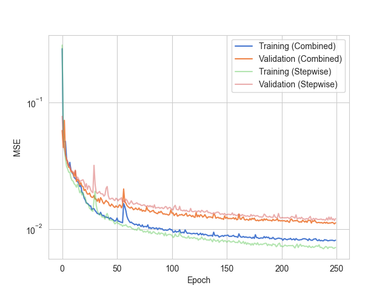

# AffineAugment

AffineAugment is a Python library for augmenting 3D medical images using affine transformations.
It allows for applying all affine transformations in one step, which can save time and reduce error.
MONAI has similar functionality, but I wanted to implement my own affine transformations to better understand the process.
I also wanted to compare the results of using my affine transformations to the results of using MONAI's affine transformations.
I am uploading this project as I believe it is a good reference for anyone who wants to understand how to implement affine transformations in Python.

#### Error Reduction in Combined Augmentations


Performing all affine transformations in one step reduced the error of the augmented images when compared to the original images.

#### Time Savings in Combined Augmentations


Performing all affine transformations in one step can save time when compared to performing each affine transformation in a separate step.

#### Training Results


Training the model with the combined augmentations resulted in better performance on the validation set and less overfitting to the training set.

## Main Files
* `affine.py` contains the functions to generate the affine transformations. Most of the linear algebra part of this project is contained in this file.
* `augment.py` contains the functions to apply the affine augmentations to the images. The rest of the linear algebra part of this project is contained in this file.
* `Report.pdf` contains my analysis of the time savings and error reduction in doing combined augmentations.
* `preprocess.py` contains the code to crop the input images into images that will fit into the network.

## Additional Files
* `test/test_augment.py` contains the unit test that compares a combined augmentation using my code and MONAI's code.
* `test/test_transforms.py` contains unit tests for testing the affine transformations against MONAI's tranformations.
* `make_examples.py` contains the code to generate the examples of the augmentations that I used in my presentation.
* `plot_comparisons.py` contains the code to generate the boxplots comparing step-wise augmentations and combined augmentations.
* `plot_training_results.py` contains the code to generate the plots of the training results.
* `train_model.py` contains the code to train the model. The arguments to this script determine whether the MONAI augmentation or my augmentation will be used for training.
* `results/` contains the results files and plots from model training and comparison between augmentation methods.
* `data/` contains some example data as well as the augmented examples generated by `make_examples.py`.
* `.requirements.txt` contains the required packages for this project.


## Installation
```
pip install -r requirements.txt
export PYTHONPATH=$PYTHONPATH:/path/to/AffineAugment
```

## Usuage
To run the unit tests showing that my affine transformations are equivalent to MONAI's affine transformations:
```
python -m unittest discover test
```

To get information about the model training script:
```
python train_model.py --help
```
```
usage: train_model.py [-h] [--augment AUGMENT] [--augmentation_probability AUGMENTATION_PROBABILITY] [--epochs EPOCHS] [--batch_size BATCH_SIZE] [--model_filename MODEL_FILENAME]

options:
  -h, --help            show this help message and exit
  --augment AUGMENT     augmentation method: (None, monai, mine)
  --augmentation_probability AUGMENTATION_PROBABILITY
                        probability of augmentation
  --epochs EPOCHS       number of epochs
  --batch_size BATCH_SIZE
                        batch size
  --model_filename MODEL_FILENAME
                        filename to save model
```

